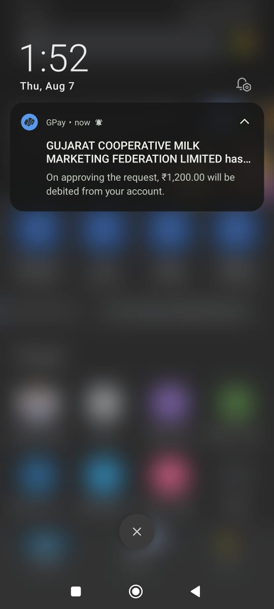
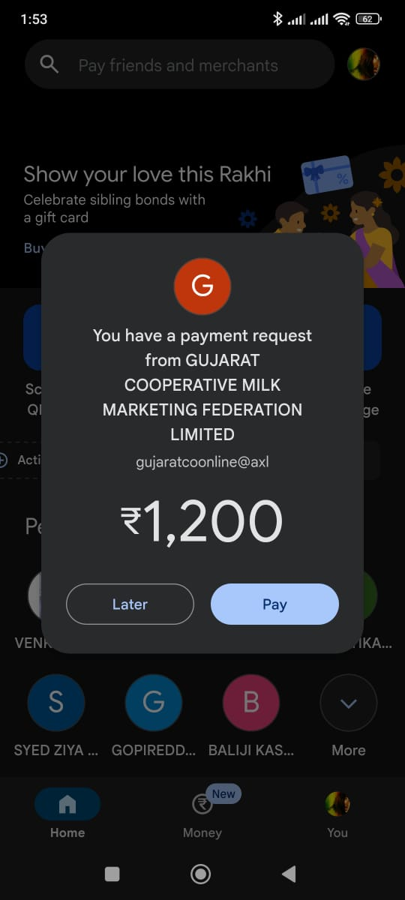

# 🥛💪 Amul Protein Auto-Order Bot

Tired of missing **Amul’s** hot drops? This script refreshes and buys **instantly** when stock appears.

---


## 🚀 What This Bot Solves

- ✅ **Instant Auto-Ordering**  
  Detects stock and places the order — before most people even finish clicking "Add to Cart".

- ✅ **Login Session Saver**  
  Skips the OTP dance. Your session stays active and ready.

- ✅ **UPI Push-to-Pay**  
  Just enter your UPI PIN on your phone — no need to fill anything manually on the website.
  
- ✅ **Adjustable Refresh Timing**  
  Want ultra-fast sniping or slower polling? You're in control.

> ⚡ Just run the script. As soon as stock drops, you'll get a UPI payment notification — tap to enter UPI pin, and it's yours.

---

## Quickstart

## 🛠️ 0) Clone the Code Locally

Bring this repository to your machine:

```bash
git clone https://github.com/deku-3/Amul-Auto-Order.git  
cd Amul-Auto-Order
pip install -r requirements.txt
```

## 🔐 1) Save Your Browser Session

Run the session saver to store your login state:
```bash  
python save_sessions.py
```
- A dummy Amul browser window will open.
- Enter your **pincode**, **phone number**, and the OTP you receive.
- If prompted, fill in your name/email, then **press ENTER** in the terminal.
- This will save a file called `auth.json` containing your cookies, headers, and session state.

✅ _You’re doing this so the script can later impersonate a logged-in, OTP-authenticated user._

---

## 🏠 2) Add Your Address

- In your real browser:
  - Log in with the **same phone/email** you used in Step 1.
  - Go to your profile and **add an address**.
- ⚠️ _The script will fail if no address is present!_

---

## ⚙️ 3) Configure Your Product & Payment

1. Open `config.py` and fill in the following:

   - **PRODUCT_URL:** Paste the full URL of your Amul product page.
   - **UPI_ID:** Your UPI ID _before_ the `@` symbol (e.g., `adityakumar123` if your UPI is `adityakumar123@okaxis`)
   - **UPI_AFTER_AT:** The part _after_ `@` (e.g., `okaxis`)
   - **UPI_SERVICE:** Your UPI app name (preferably `"Google Pay"` as it's tested)
   - **REFRESH_INTERVAL:** How often (in seconds) the script checks for product availability

2. **Save the file.**

---

## 🚀 4) Start the Watchdog

Make sure:
- Your **cart is empty**
- Your **address is added**

Then run:
```bash  
python amul_watchdog.py
```

- The script will now stay live, checking availability on your chosen product page.
- When the product drops, you’ll get a notification on your phone to enter your UPI PIN and complete the order!

## 📱 What It Looks Like

> Just approve the UPI on your phone — lightning-fast.

<p>
  
  &nbsp;&nbsp;
  
</p>

